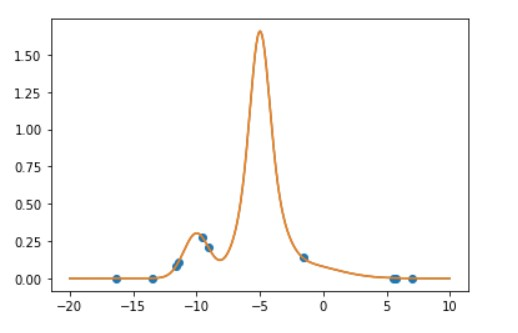
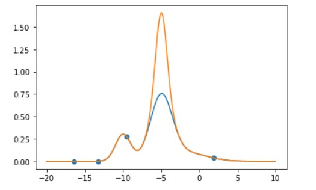

# SOP
summer of project

## 4 distributions, with only 10 data point or buckets => **high resolution data**

* predicted coefficients = [0.3 0.7 0.9 0.1]
* expected coefficients = [0.3 0.7 0.9 0.1]

## 4 distributions, with only 4 data point or buckets => **low resolution data**

* predicted coefficients = [3.00000000e-01 7.00000152e-01 1.18224532e-07 1.00000000e-01]
* expected coefficients = [0.3 0.7 0.9 0.1]
